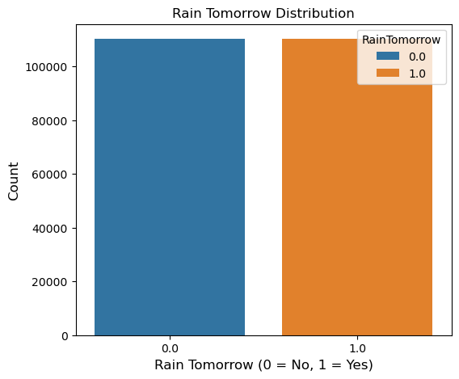

<h1 align="center">Rainfall Prediction</font></h1>

# Objective
1. To do Exploratory Data Analysis, Data preprocessing & Feature Engineering on the dataset
2. To predict whether there will be rainfall tommorrow or n using
    - Decision Trees
    - Random Forest
    - K Nearest Neighbours
    - Logistic Regression
3. To compare performace of various classification model techniqouachine

# About the dataset

## Content
This dataset contains about 10 years of daily weather observations from many locations across Australia. The dataset is already split in to test and train datasets.

## Data Description

- **Location** - Name of the city from Australia.
- **MinTemp** - The Minimum temperature during a particular day. (degree Celsius)
- **MaxTemp** - The maximum temperature during a particular day. (degree Celsius)
- **Rainfall** - Rainfall during a particular day. (millimeters)
- **Evaporation** - Evaporation during a particular day. (millimeters)
- **Sunshine** - Bright sunshine during a particular day. (hours)
- **WindGusDir** - The direction of the strongest gust during a particular day. (16 compass points)
- **WindGuSpeed** - Speed of strongest gust during a particular day. (kilometers per hour)
- **WindDir9am** - The direction of the wind for 10 min prior to 9 am. (compass points)
- **WindDir3pm** - The direction of the wind for 10 min prior to 3 pm. (compass points)
- **WindSpeed9am** - Speed of the wind for 10 min prior to 9 am. (kilometers per hour)
- **WindSpeed3pm** - Speed of the wind for 10 min prior to 3 pm. (kilometers per hour)
- **Humidity9am** - The humidity of the wind at 9 am. (percent)
- **Humidity3pm** - The humidity of the wind at 3 pm. (percent)
- **Pressure9am** - Atmospheric pressure at 9 am. (hectopascals)
- **Pressure3pm** - Atmospheric pressure at 3 pm. (hectopascals)
- **Cloud9am** - Cloud-obscured portions of the sky at 9 am. (eighths)
- **Cloud3pm** - Cloud-obscured portions of the sky at 3 pm. (eighths)
- **Temp9am** - The temperature at 9 am. (degree Celsius)
- **Temp3pm** - The temperature at 3 pm. (degree Celsius)
- **RainToday** - If today is rainy then ‘Yes’. If today is not rainy then ‘No’.
- **RainTomorrow** - If tomorrow is rainy then 1 (Yes). If tomorrow is not rainy then 0 (No).

## Data Source 
https://www.kaggle.com/datasets/jsphyg/weather-dataset-rattle-packagekraborty/australia-weather-data

## Importing the required libraries


```python
import pandas as pd
import numpy as np
import matplotlib.pyplot as plt
import seaborn as sns
import missingno as msno
import time

from sklearn.model_selection import train_test_split
from sklearn.utils import resample
from sklearn.preprocessing import StandardScaler
from sklearn.model_selection import cross_val_score

from sklearn.linear_model import LogisticRegression
from sklearn.neighbors import KNeighborsClassifier
from sklearn.tree import DecisionTreeClassifier
from sklearn.ensemble import RandomForestClassifier
from sklearn import tree

from sklearn.metrics import confusion_matrix, classification_report
from sklearn.metrics import accuracy_score, precision_score, recall_score, f1_score

```

## Importing the data


```python
# importing the dataset
df = pd.read_csv("weatherAUS.csv")
```


```python
df.head()
```


<div>
<style scoped>
    .dataframe tbody tr th:only-of-type {
        vertical-align: middle;
    }

    .dataframe tbody tr th {
        vertical-align: top;
    }

    .dataframe thead th {
        text-align: right;
    }
</style>
<table border="1" class="dataframe">
  <thead>
    <tr style="text-align: right;">
      <th></th>
      <th>Date</th>
      <th>Location</th>
      <th>MinTemp</th>
      <th>MaxTemp</th>
      <th>Rainfall</th>
      <th>Evaporation</th>
      <th>Sunshine</th>
      <th>WindGustDir</th>
      <th>WindGustSpeed</th>
      <th>WindDir9am</th>
      <th>...</th>
      <th>Humidity9am</th>
      <th>Humidity3pm</th>
      <th>Pressure9am</th>
      <th>Pressure3pm</th>
      <th>Cloud9am</th>
      <th>Cloud3pm</th>
      <th>Temp9am</th>
      <th>Temp3pm</th>
      <th>RainToday</th>
      <th>RainTomorrow</th>
    </tr>
  </thead>
  <tbody>
    <tr>
      <th>0</th>
      <td>2008-12-01</td>
      <td>Albury</td>
      <td>13.4</td>
      <td>22.9</td>
      <td>0.6</td>
      <td>NaN</td>
      <td>NaN</td>
      <td>W</td>
      <td>44.0</td>
      <td>W</td>
      <td>...</td>
      <td>71.0</td>
      <td>22.0</td>
      <td>1007.7</td>
      <td>1007.1</td>
      <td>8.0</td>
      <td>NaN</td>
      <td>16.9</td>
      <td>21.8</td>
      <td>No</td>
      <td>No</td>
    </tr>
    <tr>
      <th>1</th>
      <td>2008-12-02</td>
      <td>Albury</td>
      <td>7.4</td>
      <td>25.1</td>
      <td>0.0</td>
      <td>NaN</td>
      <td>NaN</td>
      <td>WNW</td>
      <td>44.0</td>
      <td>NNW</td>
      <td>...</td>
      <td>44.0</td>
      <td>25.0</td>
      <td>1010.6</td>
      <td>1007.8</td>
      <td>NaN</td>
      <td>NaN</td>
      <td>17.2</td>
      <td>24.3</td>
      <td>No</td>
      <td>No</td>
    </tr>
    <tr>
      <th>2</th>
      <td>2008-12-03</td>
      <td>Albury</td>
      <td>12.9</td>
      <td>25.7</td>
      <td>0.0</td>
      <td>NaN</td>
      <td>NaN</td>
      <td>WSW</td>
      <td>46.0</td>
      <td>W</td>
      <td>...</td>
      <td>38.0</td>
      <td>30.0</td>
      <td>1007.6</td>
      <td>1008.7</td>
      <td>NaN</td>
      <td>2.0</td>
      <td>21.0</td>
      <td>23.2</td>
      <td>No</td>
      <td>No</td>
    </tr>
    <tr>
      <th>3</th>
      <td>2008-12-04</td>
      <td>Albury</td>
      <td>9.2</td>
      <td>28.0</td>
      <td>0.0</td>
      <td>NaN</td>
      <td>NaN</td>
      <td>NE</td>
      <td>24.0</td>
      <td>SE</td>
      <td>...</td>
      <td>45.0</td>
      <td>16.0</td>
      <td>1017.6</td>
      <td>1012.8</td>
      <td>NaN</td>
      <td>NaN</td>
      <td>18.1</td>
      <td>26.5</td>
      <td>No</td>
      <td>No</td>
    </tr>
    <tr>
      <th>4</th>
      <td>2008-12-05</td>
      <td>Albury</td>
      <td>17.5</td>
      <td>32.3</td>
      <td>1.0</td>
      <td>NaN</td>
      <td>NaN</td>
      <td>W</td>
      <td>41.0</td>
      <td>ENE</td>
      <td>...</td>
      <td>82.0</td>
      <td>33.0</td>
      <td>1010.8</td>
      <td>1006.0</td>
      <td>7.0</td>
      <td>8.0</td>
      <td>17.8</td>
      <td>29.7</td>
      <td>No</td>
      <td>No</td>
    </tr>
  </tbody>
</table>
<p>5 rows × 23 columns</p>
</div>


## Exploratory Data Analysis, Data Preprocessing & Feature Engineering


```python
# shape of the dataset
print(f"The dataset contains {df.shape[0]} rows and {df.shape[1]} columns")
```

    The dataset contains 145460 rows and 23 columns
    


```python
# about the dataset (schema)
df.info()
```

    <class 'pandas.core.frame.DataFrame'>
    RangeIndex: 145460 entries, 0 to 145459
    Data columns (total 23 columns):
     #   Column         Non-Null Count   Dtype  
    ---  ------         --------------   -----  
     0   Date           145460 non-null  object 
     1   Location       145460 non-null  object 
     2   MinTemp        143975 non-null  float64
     3   MaxTemp        144199 non-null  float64
     4   Rainfall       142199 non-null  float64
     5   Evaporation    82670 non-null   float64
     6   Sunshine       75625 non-null   float64
     7   WindGustDir    135134 non-null  object 
     8   WindGustSpeed  135197 non-null  float64
     9   WindDir9am     134894 non-null  object 
     10  WindDir3pm     141232 non-null  object 
     11  WindSpeed9am   143693 non-null  float64
     12  WindSpeed3pm   142398 non-null  float64
     13  Humidity9am    142806 non-null  float64
     14  Humidity3pm    140953 non-null  float64
     15  Pressure9am    130395 non-null  float64
     16  Pressure3pm    130432 non-null  float64
     17  Cloud9am       89572 non-null   float64
     18  Cloud3pm       86102 non-null   float64
     19  Temp9am        143693 non-null  float64
     20  Temp3pm        141851 non-null  float64
     21  RainToday      142199 non-null  object 
     22  RainTomorrow   142193 non-null  object 
    dtypes: float64(16), object(7)
    memory usage: 25.5+ MB
    


```python
# checking for duplicate rows/observations
df.duplicated().max()
```


    False


No duplicate rows are observed in the dataset


```python
# listing columns with numerical values and categorical values 

cat_cols = []
num_cols = []

for i in df.columns:
    if df[i].dtype == 'O':
        cat_cols.append(i)
    else:
        num_cols.append(i)

print(f"Columns with numerical values: {cat_cols}")
print(f"Columns with categorical values: {num_cols}")
```

    Columns with numerical values: ['Date', 'Location', 'WindGustDir', 'WindDir9am', 'WindDir3pm', 'RainToday', 'RainTomorrow']
    Columns with categorical values: ['MinTemp', 'MaxTemp', 'Rainfall', 'Evaporation', 'Sunshine', 'WindGustSpeed', 'WindSpeed9am', 'WindSpeed3pm', 'Humidity9am', 'Humidity3pm', 'Pressure9am', 'Pressure3pm', 'Cloud9am', 'Cloud3pm', 'Temp9am', 'Temp3pm']
    


```python
# unique values in column 'RainTomorrow'
df['RainTomorrow'].unique()
```


    array(['No', 'Yes', nan], dtype=object)


## Visualizing Correlations


```python
# replacing 'Yes' with 1 and 'No' with 0
df_temp = df
df_temp['RainTomorrow'].replace({'Yes': 1, 'No': 0}, inplace = True)
```


```python
# looking at the correlation heatmap
plt.figure(figsize = (16, 10))
sns.heatmap(df_temp[[col for col in df.columns if df[col].dtype != 'O']].corr(), annot = True, fmt = '.2f')
plt.show()
```


    

    


```python
# identifying columns with strong correlation 

correlation_matrix = df_temp[[col for col in df.columns if df[col].dtype != 'O']].corr()

threshold = 0.7
# filter correlations greater than the threshold and not equal to 1
filtered_corr_matrix = (np.abs(correlation_matrix) >= threshold) & (np.abs(correlation_matrix) != 1)

# Use the filtered_corr_matrix to get column names where correlation is above the threshold
high_corr_cols = correlation_matrix.columns[filtered_corr_matrix.any(axis=0)].tolist()

print(high_corr_cols)
```

    ['MinTemp', 'MaxTemp', 'Sunshine', 'Pressure9am', 'Pressure3pm', 'Cloud3pm', 'Temp9am', 'Temp3pm']
    


```python
# looking at the pairplot for columns with stong correlation
sns.pairplot(df_temp, vars = (high_corr_cols), hue = 'RainTomorrow')
plt.show()
```


    

    


## Numerical columns


```python
# total missing values in numerical columns
pd.concat([df[num_cols].count(), df[num_cols].isna().sum(), (df[num_cols].isna().sum()/len(df))*100], 
          axis = 1, 
          keys = ["Total Count of Values", "Total Missing Values", "Percent of Missing Values"])
```


<div>
<style scoped>
    .dataframe tbody tr th:only-of-type {
        vertical-align: middle;
    }

    .dataframe tbody tr th {
        vertical-align: top;
    }

    .dataframe thead th {
        text-align: right;
    }
</style>
<table border="1" class="dataframe">
  <thead>
    <tr style="text-align: right;">
      <th></th>
      <th>Total Count of Values</th>
      <th>Total Missing Values</th>
      <th>Percent of Missing Values</th>
    </tr>
  </thead>
  <tbody>
    <tr>
      <th>MinTemp</th>
      <td>143975</td>
      <td>1485</td>
      <td>1.020899</td>
    </tr>
    <tr>
      <th>MaxTemp</th>
      <td>144199</td>
      <td>1261</td>
      <td>0.866905</td>
    </tr>
    <tr>
      <th>Rainfall</th>
      <td>142199</td>
      <td>3261</td>
      <td>2.241853</td>
    </tr>
    <tr>
      <th>Evaporation</th>
      <td>82670</td>
      <td>62790</td>
      <td>43.166506</td>
    </tr>
    <tr>
      <th>Sunshine</th>
      <td>75625</td>
      <td>69835</td>
      <td>48.009762</td>
    </tr>
    <tr>
      <th>WindGustSpeed</th>
      <td>135197</td>
      <td>10263</td>
      <td>7.055548</td>
    </tr>
    <tr>
      <th>WindSpeed9am</th>
      <td>143693</td>
      <td>1767</td>
      <td>1.214767</td>
    </tr>
    <tr>
      <th>WindSpeed3pm</th>
      <td>142398</td>
      <td>3062</td>
      <td>2.105046</td>
    </tr>
    <tr>
      <th>Humidity9am</th>
      <td>142806</td>
      <td>2654</td>
      <td>1.824557</td>
    </tr>
    <tr>
      <th>Humidity3pm</th>
      <td>140953</td>
      <td>4507</td>
      <td>3.098446</td>
    </tr>
    <tr>
      <th>Pressure9am</th>
      <td>130395</td>
      <td>15065</td>
      <td>10.356799</td>
    </tr>
    <tr>
      <th>Pressure3pm</th>
      <td>130432</td>
      <td>15028</td>
      <td>10.331363</td>
    </tr>
    <tr>
      <th>Cloud9am</th>
      <td>89572</td>
      <td>55888</td>
      <td>38.421559</td>
    </tr>
    <tr>
      <th>Cloud3pm</th>
      <td>86102</td>
      <td>59358</td>
      <td>40.807095</td>
    </tr>
    <tr>
      <th>Temp9am</th>
      <td>143693</td>
      <td>1767</td>
      <td>1.214767</td>
    </tr>
    <tr>
      <th>Temp3pm</th>
      <td>141851</td>
      <td>3609</td>
      <td>2.481094</td>
    </tr>
  </tbody>
</table>
</div>


```python
# visualizing missing values in the dataset with numerical columns
msno.matrix(df[num_cols], color=(0.4,0.2,0.5))
```


    <Axes: >


    

    


```python
# creating histograms for all the numerical columns

number_cols = len(num_cols)

cols = 3
rows = (number_cols//cols +1)

fig, axis = plt.subplots(nrows = rows, ncols = cols, figsize=(15, 3*rows))

axis = axis.flatten()

for i, col in enumerate(num_cols):
    sns.histplot(df, x=df[col], kde=True, bins = 30, color=sns.color_palette('hls', len(num_cols))[i], ax=axis[i])
    axis[i].set_title(col)
    axis[i].set_xlabel(col)
    axis[i].set_ylabel('Count')
    
    axis[i].text(0.95, 0.95, f"Mean: {df[col].mean():.2f}", ha='right', va='top', transform=axis[i].transAxes, fontsize=10, color='blue')
    axis[i].text(0.95, 0.85, f"Median: {df[col].median():.2f}", ha='right', va='top', transform=axis[i].transAxes, fontsize=10, color='green')
    axis[i].text(0.95, 0.75, f"Mode: {df[col].mode()[0]:.2f}", ha='right', va='top', transform=axis[i].transAxes, fontsize=10, color='red')
    
    axis[i].axvline(df[col].mean(), color='blue', linestyle='dashed', linewidth=1)
    axis[i].axvline(df[col].median(), color='green', linestyle='dashed', linewidth=1)
    axis[i].axvline(df[col].mode()[0], color='red', linestyle='dashed', linewidth=1)
    
    
for i in range(number_cols, len(axis)):
    axis[i].axis('off')

plt.tight_layout()
plt.show()
```


    

    


```python
# finding mean, median, mode & skewness (note: values may be affected by outliers)
mean, median, mode, skew = [], [], [], []

for i in num_cols:
    mean.append(df[i].mean())
    median.append(df[i].median())
    mode.append(df[i].mode().iloc[0])
    skew.append((df[i].mean() - df[i].median()) / df[i].std())

stats = pd.DataFrame({"Columns": num_cols, "Mean": mean, "Median": median, "Mode": mode, "Skewness": skew})
stats
```


<div>
<style scoped>
    .dataframe tbody tr th:only-of-type {
        vertical-align: middle;
    }

    .dataframe tbody tr th {
        vertical-align: top;
    }

    .dataframe thead th {
        text-align: right;
    }
</style>
<table border="1" class="dataframe">
  <thead>
    <tr style="text-align: right;">
      <th></th>
      <th>Columns</th>
      <th>Mean</th>
      <th>Median</th>
      <th>Mode</th>
      <th>Skewness</th>
    </tr>
  </thead>
  <tbody>
    <tr>
      <th>0</th>
      <td>MinTemp</td>
      <td>12.194034</td>
      <td>12.0</td>
      <td>11.0</td>
      <td>0.030325</td>
    </tr>
    <tr>
      <th>1</th>
      <td>MaxTemp</td>
      <td>23.221348</td>
      <td>22.6</td>
      <td>20.0</td>
      <td>0.087280</td>
    </tr>
    <tr>
      <th>2</th>
      <td>Rainfall</td>
      <td>2.360918</td>
      <td>0.0</td>
      <td>0.0</td>
      <td>0.278474</td>
    </tr>
    <tr>
      <th>3</th>
      <td>Evaporation</td>
      <td>5.468232</td>
      <td>4.8</td>
      <td>4.0</td>
      <td>0.159342</td>
    </tr>
    <tr>
      <th>4</th>
      <td>Sunshine</td>
      <td>7.611178</td>
      <td>8.4</td>
      <td>0.0</td>
      <td>-0.208381</td>
    </tr>
    <tr>
      <th>5</th>
      <td>WindGustSpeed</td>
      <td>40.035230</td>
      <td>39.0</td>
      <td>35.0</td>
      <td>0.076080</td>
    </tr>
    <tr>
      <th>6</th>
      <td>WindSpeed9am</td>
      <td>14.043426</td>
      <td>13.0</td>
      <td>9.0</td>
      <td>0.117037</td>
    </tr>
    <tr>
      <th>7</th>
      <td>WindSpeed3pm</td>
      <td>18.662657</td>
      <td>19.0</td>
      <td>13.0</td>
      <td>-0.038292</td>
    </tr>
    <tr>
      <th>8</th>
      <td>Humidity9am</td>
      <td>68.880831</td>
      <td>70.0</td>
      <td>99.0</td>
      <td>-0.058813</td>
    </tr>
    <tr>
      <th>9</th>
      <td>Humidity3pm</td>
      <td>51.539116</td>
      <td>52.0</td>
      <td>52.0</td>
      <td>-0.022162</td>
    </tr>
    <tr>
      <th>10</th>
      <td>Pressure9am</td>
      <td>1017.649940</td>
      <td>1017.6</td>
      <td>1016.4</td>
      <td>0.007027</td>
    </tr>
    <tr>
      <th>11</th>
      <td>Pressure3pm</td>
      <td>1015.255889</td>
      <td>1015.2</td>
      <td>1015.3</td>
      <td>0.007942</td>
    </tr>
    <tr>
      <th>12</th>
      <td>Cloud9am</td>
      <td>4.447461</td>
      <td>5.0</td>
      <td>7.0</td>
      <td>-0.191378</td>
    </tr>
    <tr>
      <th>13</th>
      <td>Cloud3pm</td>
      <td>4.509930</td>
      <td>5.0</td>
      <td>7.0</td>
      <td>-0.180149</td>
    </tr>
    <tr>
      <th>14</th>
      <td>Temp9am</td>
      <td>16.990631</td>
      <td>16.7</td>
      <td>17.0</td>
      <td>0.044790</td>
    </tr>
    <tr>
      <th>15</th>
      <td>Temp3pm</td>
      <td>21.683390</td>
      <td>21.1</td>
      <td>20.0</td>
      <td>0.084103</td>
    </tr>
  </tbody>
</table>
</div>


From above histograms and table we can assume on what technique to be used to fill missing values in numerical columns,
1. **Mean Imputation** - (Symmetrical, mean ~ median ~ mode, skewness ~ 0) - MinTemp, MaxTemp, WindGustSpeed, WindSpeed3pm, Humidity9am, Humidity3pm, Pressure9am, Teamp9am, Pressure3pm, Temp3pm
2. **Median Imputaion** -
   - **Right skewed**: (mean > median > mode, skewness > 0) - Rainfall, Evaporation, , WindSpeed9am, 
   - **Left skewed**: (mean < median < mode, skewness < 0) - Sunshine
3. **Mode Imputaion** - (multiple peeks) - Cloud9am, Cloud3pm


```python
# mean imputation
mean_cols = [ stats['Columns'][i] 
             for i in range(0, len(stats)) 
             if stats['Skewness'][i] <= 0.1 and stats['Skewness'][i] >= -0.1] # columns with near normal distribution

# filling missing values using mean
for i in mean_cols:
    df[i]=df[i].fillna(df[i].mean())

```


```python
# mode imputation
mode_cols = ['Cloud9am', 'Cloud3pm']

# filling missing values using mode
for i in mode_cols:
    df[i]=df[i].fillna(df[i].mode()[0])
```


```python
# median imputation
median_cols = [ stats['Columns'][i] 
             for i in range(0, len(stats)) 
             if stats['Skewness'][i] > 0.1 or stats['Skewness'][i] < -0.1] # columns with near normal distribution

# removing cols which are to be processed via mode imputation
median_cols = [col for col in median_cols if col not in mode_cols] 

# filling missing values using median
for i in median_cols:
    df[i]=df[i].fillna(df[i].median())
```


```python
# checking for missing values
print(df[num_cols].isna().max().max())

msno.matrix(df[num_cols],color=(0.4,0.2,0.5))
```

    False
    


    <Axes: >


    

    


## Categorical columns


```python
# total missing values in categorical columns 
pd.concat([df[cat_cols].count(), df[cat_cols].isna().sum(), (df[cat_cols].isna().sum() / len(df)) * 100], 
          axis = 1,
         keys = ['Total Count of Values', 'Total Missing Values', 'Percent of Missing Values'])
```


<div>
<style scoped>
    .dataframe tbody tr th:only-of-type {
        vertical-align: middle;
    }

    .dataframe tbody tr th {
        vertical-align: top;
    }

    .dataframe thead th {
        text-align: right;
    }
</style>
<table border="1" class="dataframe">
  <thead>
    <tr style="text-align: right;">
      <th></th>
      <th>Total Count of Values</th>
      <th>Total Missing Values</th>
      <th>Percent of Missing Values</th>
    </tr>
  </thead>
  <tbody>
    <tr>
      <th>Date</th>
      <td>145460</td>
      <td>0</td>
      <td>0.000000</td>
    </tr>
    <tr>
      <th>Location</th>
      <td>145460</td>
      <td>0</td>
      <td>0.000000</td>
    </tr>
    <tr>
      <th>WindGustDir</th>
      <td>135134</td>
      <td>10326</td>
      <td>7.098859</td>
    </tr>
    <tr>
      <th>WindDir9am</th>
      <td>134894</td>
      <td>10566</td>
      <td>7.263853</td>
    </tr>
    <tr>
      <th>WindDir3pm</th>
      <td>141232</td>
      <td>4228</td>
      <td>2.906641</td>
    </tr>
    <tr>
      <th>RainToday</th>
      <td>142199</td>
      <td>3261</td>
      <td>2.241853</td>
    </tr>
    <tr>
      <th>RainTomorrow</th>
      <td>142193</td>
      <td>3267</td>
      <td>2.245978</td>
    </tr>
  </tbody>
</table>
</div>


```python
# visualizing missing values

msno.matrix(df[cat_cols],color=(0.4,0.2,0.5))
```


    <Axes: >


    

    


```python
# columns 'Date', 'location' and 'RainTomorrow' will be processed in upcomming steps
for i in ['WindGustDir', 'WindDir9am', 'WindDir3pm', 'RainToday']:
    print(df[i].value_counts(dropna = False))
```

    WindGustDir
    NaN    10326
    W       9915
    SE      9418
    N       9313
    SSE     9216
    E       9181
    S       9168
    WSW     9069
    SW      8967
    SSW     8736
    WNW     8252
    NW      8122
    ENE     8104
    ESE     7372
    NE      7133
    NNW     6620
    NNE     6548
    Name: count, dtype: int64
    WindDir9am
    N      11758
    NaN    10566
    SE      9287
    E       9176
    SSE     9112
    NW      8749
    S       8659
    W       8459
    SW      8423
    NNE     8129
    NNW     7980
    ENE     7836
    NE      7671
    ESE     7630
    SSW     7587
    WNW     7414
    WSW     7024
    Name: count, dtype: int64
    WindDir3pm
    SE     10838
    W      10110
    S       9926
    WSW     9518
    SSE     9399
    SW      9354
    N       8890
    WNW     8874
    NW      8610
    ESE     8505
    E       8472
    NE      8263
    SSW     8156
    NNW     7870
    ENE     7857
    NNE     6590
    NaN     4228
    Name: count, dtype: int64
    RainToday
    No     110319
    Yes     31880
    NaN      3261
    Name: count, dtype: int64
    


```python
# mode imputation on 'RainToday' column
df['RainToday']=df['RainToday'].fillna(df['RainToday'].mode()[0])

# replacing 'Yes' with 1 and 'No' with 0
df['RainToday'].replace({'Yes': 1, 'No': 0}, inplace = True)
```


```python
# verifying
print(f" Missing values: {df['RainToday'].isna().sum()}")
df['RainToday'].sample(5)
```

     Missing values: 0
    


    293       0
    79120     0
    123063    0
    56712     0
    94915     0
    Name: RainToday, dtype: int64


```python
# random sampling on 'WindGustDir', 'WindDir9am' and 'WindDir3pm' columns
ran_cols = ['WindGustDir', 'WindDir9am', 'WindDir3pm']

np.random.seed(42)

for col in ran_cols:
    rows_with_nan = df[col].isna()

    unique_values = df[col].dropna().unique()
    random_values = np.random.choice(unique_values, size = rows_with_nan.sum(), replace = True)

    df.loc[rows_with_nan, col] = random_values
```


```python
# verifying
df[ran_cols].isna().sum()
```


    WindGustDir    0
    WindDir9am     0
    WindDir3pm     0
    dtype: int64


```python
# lets split date into Day, Month and Year

df['Date'] = pd.to_datetime(df['Date'])

df['Day'] = df['Date'].dt.day
df['Month'] = df['Date'].dt.month
df['Year'] = df['Date'].dt.year

df.drop('Date', axis = 1, inplace = True)
```


```python
# looking at the changes
df[['Day', 'Month', 'Year']].sample(5)
```


<div>
<style scoped>
    .dataframe tbody tr th:only-of-type {
        vertical-align: middle;
    }

    .dataframe tbody tr th {
        vertical-align: top;
    }

    .dataframe thead th {
        text-align: right;
    }
</style>
<table border="1" class="dataframe">
  <thead>
    <tr style="text-align: right;">
      <th></th>
      <th>Day</th>
      <th>Month</th>
      <th>Year</th>
    </tr>
  </thead>
  <tbody>
    <tr>
      <th>113464</th>
      <td>27</td>
      <td>4</td>
      <td>2014</td>
    </tr>
    <tr>
      <th>39881</th>
      <td>10</td>
      <td>12</td>
      <td>2009</td>
    </tr>
    <tr>
      <th>89773</th>
      <td>16</td>
      <td>3</td>
      <td>2016</td>
    </tr>
    <tr>
      <th>119452</th>
      <td>28</td>
      <td>3</td>
      <td>2014</td>
    </tr>
    <tr>
      <th>13619</th>
      <td>30</td>
      <td>6</td>
      <td>2013</td>
    </tr>
  </tbody>
</table>
</div>


```python
# unique values in 'RainTomorrow'
df['RainTomorrow'].unique()
```


    array([ 0.,  1., nan])


```python
# for missing values in column 'RainTomorrow' we will remove the rows with missing values as 'RainTomorrow' is the target variable
df.dropna(subset=['RainTomorrow'], inplace=True)
```


```python
# verifying
print(f" Missing values: {df['RainTomorrow'].isna().sum()}")
df['RainTomorrow'].sample(5)
```

     Missing values: 0
    


    30957     0.0
    16435     0.0
    103509    0.0
    25970     0.0
    48311     1.0
    Name: RainTomorrow, dtype: float64


```python
# visual verification on missing values
msno.matrix(df[['Day', 'Month', 'Year', 'WindGustDir', 'WindDir9am', 'WindDir3pm', 'RainToday', 'RainTomorrow']],color=(0.4,0.2,0.5))
```


    <Axes: >


    

    


## One-Hot Encoding


```python
df.info()
```

    <class 'pandas.core.frame.DataFrame'>
    Index: 142193 entries, 0 to 145458
    Data columns (total 25 columns):
     #   Column         Non-Null Count   Dtype  
    ---  ------         --------------   -----  
     0   Location       142193 non-null  object 
     1   MinTemp        142193 non-null  float64
     2   MaxTemp        142193 non-null  float64
     3   Rainfall       142193 non-null  float64
     4   Evaporation    142193 non-null  float64
     5   Sunshine       142193 non-null  float64
     6   WindGustDir    142193 non-null  object 
     7   WindGustSpeed  142193 non-null  float64
     8   WindDir9am     142193 non-null  object 
     9   WindDir3pm     142193 non-null  object 
     10  WindSpeed9am   142193 non-null  float64
     11  WindSpeed3pm   142193 non-null  float64
     12  Humidity9am    142193 non-null  float64
     13  Humidity3pm    142193 non-null  float64
     14  Pressure9am    142193 non-null  float64
     15  Pressure3pm    142193 non-null  float64
     16  Cloud9am       142193 non-null  float64
     17  Cloud3pm       142193 non-null  float64
     18  Temp9am        142193 non-null  float64
     19  Temp3pm        142193 non-null  float64
     20  RainToday      142193 non-null  int64  
     21  RainTomorrow   142193 non-null  float64
     22  Day            142193 non-null  int32  
     23  Month          142193 non-null  int32  
     24  Year           142193 non-null  int32  
    dtypes: float64(17), int32(3), int64(1), object(4)
    memory usage: 26.6+ MB
    


```python
# one-hot encoding all categorical cols except day, month and year
encode_columns = [col for col in df.columns if df[col].dtype == 'O']

for col in encode_columns:
    df = pd.get_dummies(df, columns=[col])

df.replace({True: 1, False: 0}, inplace = True)
```


```python
df.sample(5)
```


<div>
<style scoped>
    .dataframe tbody tr th:only-of-type {
        vertical-align: middle;
    }

    .dataframe tbody tr th {
        vertical-align: top;
    }

    .dataframe thead th {
        text-align: right;
    }
</style>
<table border="1" class="dataframe">
  <thead>
    <tr style="text-align: right;">
      <th></th>
      <th>MinTemp</th>
      <th>MaxTemp</th>
      <th>Rainfall</th>
      <th>Evaporation</th>
      <th>Sunshine</th>
      <th>WindGustSpeed</th>
      <th>WindSpeed9am</th>
      <th>WindSpeed3pm</th>
      <th>Humidity9am</th>
      <th>Humidity3pm</th>
      <th>...</th>
      <th>WindDir3pm_NNW</th>
      <th>WindDir3pm_NW</th>
      <th>WindDir3pm_S</th>
      <th>WindDir3pm_SE</th>
      <th>WindDir3pm_SSE</th>
      <th>WindDir3pm_SSW</th>
      <th>WindDir3pm_SW</th>
      <th>WindDir3pm_W</th>
      <th>WindDir3pm_WNW</th>
      <th>WindDir3pm_WSW</th>
    </tr>
  </thead>
  <tbody>
    <tr>
      <th>51402</th>
      <td>0.000000</td>
      <td>16.900000</td>
      <td>0.0</td>
      <td>4.8</td>
      <td>8.4</td>
      <td>48.0</td>
      <td>4.0</td>
      <td>11.0</td>
      <td>81.000000</td>
      <td>38.000000</td>
      <td>...</td>
      <td>0</td>
      <td>0</td>
      <td>0</td>
      <td>0</td>
      <td>0</td>
      <td>0</td>
      <td>0</td>
      <td>0</td>
      <td>0</td>
      <td>0</td>
    </tr>
    <tr>
      <th>27135</th>
      <td>6.600000</td>
      <td>20.700000</td>
      <td>0.0</td>
      <td>4.8</td>
      <td>8.4</td>
      <td>13.0</td>
      <td>2.0</td>
      <td>7.0</td>
      <td>80.000000</td>
      <td>44.000000</td>
      <td>...</td>
      <td>0</td>
      <td>0</td>
      <td>0</td>
      <td>0</td>
      <td>0</td>
      <td>0</td>
      <td>0</td>
      <td>0</td>
      <td>0</td>
      <td>0</td>
    </tr>
    <tr>
      <th>22529</th>
      <td>19.800000</td>
      <td>24.700000</td>
      <td>0.0</td>
      <td>4.4</td>
      <td>8.5</td>
      <td>37.0</td>
      <td>26.0</td>
      <td>20.0</td>
      <td>80.000000</td>
      <td>73.000000</td>
      <td>...</td>
      <td>0</td>
      <td>0</td>
      <td>0</td>
      <td>0</td>
      <td>0</td>
      <td>0</td>
      <td>0</td>
      <td>0</td>
      <td>0</td>
      <td>0</td>
    </tr>
    <tr>
      <th>18700</th>
      <td>12.194034</td>
      <td>23.221348</td>
      <td>0.0</td>
      <td>4.8</td>
      <td>8.4</td>
      <td>24.0</td>
      <td>13.0</td>
      <td>15.0</td>
      <td>68.880831</td>
      <td>51.539116</td>
      <td>...</td>
      <td>0</td>
      <td>0</td>
      <td>0</td>
      <td>0</td>
      <td>0</td>
      <td>0</td>
      <td>0</td>
      <td>0</td>
      <td>0</td>
      <td>0</td>
    </tr>
    <tr>
      <th>22636</th>
      <td>17.200000</td>
      <td>21.400000</td>
      <td>11.0</td>
      <td>1.2</td>
      <td>5.2</td>
      <td>41.0</td>
      <td>11.0</td>
      <td>20.0</td>
      <td>89.000000</td>
      <td>83.000000</td>
      <td>...</td>
      <td>0</td>
      <td>0</td>
      <td>1</td>
      <td>0</td>
      <td>0</td>
      <td>0</td>
      <td>0</td>
      <td>0</td>
      <td>0</td>
      <td>0</td>
    </tr>
  </tbody>
</table>
<p>5 rows × 118 columns</p>
</div>


```python
df.shape
```


    (142193, 118)


## Rain Tomorrow (Target) Distribution


```python
# visulaizing the 'RainTomorrow' distribution
plt.figure(figsize = (6,5))
sns.countplot(data=df, x='RainTomorrow', hue = 'RainTomorrow')

plt.title('Rain Tomorrow Distribution', fontsize=12)
plt.xlabel('Rain Tomorrow (0 = No, 1 = Yes)', fontsize=12)
plt.ylabel('Count', fontsize=12)
plt.show()
```


    

    


```python
pd.concat([df['RainTomorrow'].value_counts(), (df['RainTomorrow'].value_counts()/len(df)) * 100], axis = 1, keys = ['Count', 'Percent'])
```


<div>
<style scoped>
    .dataframe tbody tr th:only-of-type {
        vertical-align: middle;
    }

    .dataframe tbody tr th {
        vertical-align: top;
    }

    .dataframe thead th {
        text-align: right;
    }
</style>
<table border="1" class="dataframe">
  <thead>
    <tr style="text-align: right;">
      <th></th>
      <th>Count</th>
      <th>Percent</th>
    </tr>
    <tr>
      <th>RainTomorrow</th>
      <th></th>
      <th></th>
    </tr>
  </thead>
  <tbody>
    <tr>
      <th>0.0</th>
      <td>110316</td>
      <td>77.581878</td>
    </tr>
    <tr>
      <th>1.0</th>
      <td>31877</td>
      <td>22.418122</td>
    </tr>
  </tbody>
</table>
</div>


It can be that the dataset is not well balanced. RainTomorrow with value 0 indicating 'No' is dominant and can cause bias in the prediction. Hence we will oversample the datadet to make it balanced.


```python
# oversampling df to make it balanced
df_yes = df[df['RainTomorrow'] == 1]
df_no = df[df['RainTomorrow'] == 0]

oversamp_df_yes = resample(df_yes, replace = True, n_samples = len(df_no), random_state = 42)

df = pd.concat([df_no, oversamp_df_yes])

df.shape
```


    (220632, 118)


```python
# visulaizing the 'RainTomorrow' distribution
plt.figure(figsize = (6,5))
sns.countplot(data=df, x='RainTomorrow', hue = 'RainTomorrow')

plt.title('Rain Tomorrow Distribution', fontsize=12)
plt.xlabel('Rain Tomorrow (0 = No, 1 = Yes)', fontsize=12)
plt.ylabel('Count', fontsize=12)
plt.show()
```


    

    


```python
pd.concat([df['RainTomorrow'].value_counts(), (df['RainTomorrow'].value_counts()/len(df)) * 100], axis = 1, keys = ['Count', 'Percent'])
```


<div>
<style scoped>
    .dataframe tbody tr th:only-of-type {
        vertical-align: middle;
    }

    .dataframe tbody tr th {
        vertical-align: top;
    }

    .dataframe thead th {
        text-align: right;
    }
</style>
<table border="1" class="dataframe">
  <thead>
    <tr style="text-align: right;">
      <th></th>
      <th>Count</th>
      <th>Percent</th>
    </tr>
    <tr>
      <th>RainTomorrow</th>
      <th></th>
      <th></th>
    </tr>
  </thead>
  <tbody>
    <tr>
      <th>0.0</th>
      <td>110316</td>
      <td>50.0</td>
    </tr>
    <tr>
      <th>1.0</th>
      <td>110316</td>
      <td>50.0</td>
    </tr>
  </tbody>
</table>
</div>


## Train Test Split
Spliting the dataset to Train and Test datasets


```python
# splitting dataset to train and test datasets

X = df.drop(columns = 'RainTomorrow')
y = df['RainTomorrow']

X_train, X_test, y_train, y_test = train_test_split(X, y, test_size = 0.2, random_state = 42)

print(f"Train dataset shape = {X_train.shape}")
print(f"Test dataset shape = {X_test.shape}")
```

    Train dataset shape = (176505, 117)
    Test dataset shape = (44127, 117)
    

## Decision Tree Classifier


```python
# initializing and training decision Tree classification model
clf_tree = DecisionTreeClassifier(criterion = 'entropy', random_state = 42)
clf_tree.fit(X_train, y_train)
```


```python
# predicting on test dataset
y_pred = clf_tree.predict(X_test)
```


```python
# evaluating the accuracy of the model
accuracy = accuracy_score(y_test, y_pred)
print(f"Accuracy: {accuracy * 100:.2f}%")
```

    Accuracy: 91.28%
    


```python
# checking of overfitting
print(f"Accuracy on test dataset: {accuracy_score(y_test, clf_tree.predict(X_test))*100:.2f}%")
print(f"Accuracy on train dataset: {accuracy_score(y_train, clf_tree.predict(X_train))*100:.2f}%")
```

    Accuracy on test dataset: 91.28%
    Accuracy on train dataset: 100.00%
    

From above it is observed that the accuracy on train data is 100% and the difference between the test and train accuracies, this indicates there might be a potential overfit of the model 


```python
# lets check the consitancy of the model accross different splits of the dataset
cv_scores = cross_val_score(clf_tree, X_train, y_train, cv=5)  # 5-fold cross-validation

print("Cross-Validation Scores:", cv_scores)
print("Mean Cross-Validation Score:", cv_scores.mean())
```

    Cross-Validation Scores: [0.89255262 0.8895782  0.89507379 0.89280757 0.89331747]
    Mean Cross-Validation Score: 0.892665930143622
    

From above cross validation the accuracy is consitant across different data splits and the average is comparable to the the accuracy score obtaines from earlier. Hence lets try adjusting max_depth paramenter.


```python
# finding what was the max_depth the model used 
print("Maximum Depth of the Trained Decision Tree:", clf_tree.tree_.max_depth)
```

    Maximum Depth of the Trained Decision Tree: 46
    


```python
# lets train the model with different values of max depth from 10 to 40 increamenting in 10s
i = 10
stats = []

while i <= 40:
    clf_tree = DecisionTreeClassifier(criterion='entropy', max_depth=i, random_state=42)
    clf_tree.fit(X_train, y_train)
    print(f"Training with max depth: {i} Done!")
    stats.append({'Max Depth': i,
                  'Test Accuracy Score': round(accuracy_score(y_test, clf_tree.predict(X_test)) * 100, 2),
                  'Train Accuracy Score': round(accuracy_score(y_train, clf_tree.predict(X_train)) * 100, 2) 
                 })
    i += 5
```

    Training with max depth: 10 Done!
    Training with max depth: 15 Done!
    Training with max depth: 20 Done!
    Training with max depth: 25 Done!
    Training with max depth: 30 Done!
    Training with max depth: 35 Done!
    Training with max depth: 40 Done!
    


```python
# lets visualize the above to get a better understanding
print(pd.DataFrame(stats))

plt.figure(figsize=(5, 3))
sns.lineplot(data=pd.DataFrame(stats), x='Max Depth', y='Test Accuracy Score', label='Test Accuracy')
sns.lineplot(data=pd.DataFrame(stats), x='Max Depth', y='Train Accuracy Score', label='Train Accuracy')

plt.title('Accuracy Scores vs Max Depth')
plt.xlabel('Max Depth')
plt.ylabel('Accuracy (%)')
plt.legend(title="Accuracy", loc="best")
plt.grid(True)
plt.show()
```

       Max Depth  Test Accuracy Score  Train Accuracy Score
    0         10                78.99                 79.95
    1         15                82.46                 86.57
    2         20                86.68                 93.05
    3         25                89.17                 97.07
    4         30                90.68                 99.14
    5         35                91.07                 99.80
    6         40                91.19                 99.98
    


    

    


It can be observed that the gain in accuracy score of the train data becomes almost negligible after 30, Lets look into max_depth from 25 to 30


```python
# training model wih max depth from 25 to 30 increament in 1s
i = 25
stats = []

while i <= 30:
    clf_tree = DecisionTreeClassifier(criterion='entropy', max_depth=i, random_state=42)
    clf_tree.fit(X_train, y_train)
    print(f"Training with max depth: {i} Done!")
    stats.append({'Max Depth': i,
                  'Test Accuracy Score': round(accuracy_score(y_test, clf_tree.predict(X_test)) * 100, 2),
                  'Train Accuracy Score': round(accuracy_score(y_train, clf_tree.predict(X_train)) * 100, 2) 
                 })
    i += 1
```

    Training with max depth: 25 Done!
    Training with max depth: 26 Done!
    Training with max depth: 27 Done!
    Training with max depth: 28 Done!
    Training with max depth: 29 Done!
    Training with max depth: 30 Done!
    


```python
# visualizing the result
print(pd.DataFrame(stats))

plt.figure(figsize=(5, 3))
sns.lineplot(data=pd.DataFrame(stats), x='Max Depth', y='Test Accuracy Score', label='Test Accuracy')
sns.lineplot(data=pd.DataFrame(stats), x='Max Depth', y='Train Accuracy Score', label='Train Accuracy')

plt.title('Accuracy Scores vs Max Depth')
plt.xlabel('Max Depth')
plt.ylabel('Accuracy (%)')
plt.legend(title="Accuracy", loc="best")
plt.grid(True)
plt.show()
```

       Max Depth  Test Accuracy Score  Train Accuracy Score
    0         25                89.17                 97.07
    1         26                89.59                 97.66
    2         27                90.08                 98.12
    3         28                90.27                 98.61
    4         29                90.50                 98.89
    5         30                90.68                 99.14
    


    

    


From above it is observed that the difference between train accuracy and test accuracy is consistant along changeing Max Depth, Hence for optimal value we go with Max Depth = 27


```python
start_time = time.time()

# training model with max_depth = 27
clf_tree = DecisionTreeClassifier(criterion = 'entropy', max_depth=27, random_state=42)
clf_tree.fit(X_train, y_train)

train_end_time = time.time()

# predicting on test dataset
y_pred_tree = clf_tree.predict(X_test)

pred_end_time = time.time()

train_time_tree = train_end_time - start_time
pred_time_tree = pred_end_time - train_end_time
total_time_tree = pred_end_time - start_time

# function used to convert time taken in seconds to hr, min & sec
def format_time(seconds):
    hours, remainder = divmod(seconds, 3600)
    minutes, seconds = divmod(remainder, 60)
    return f"{int(hours)}h {int(minutes)}min {seconds:.2f}s"

print(f"Training Time: {format_time(train_time_tree)}")
print(f"Evaluation Time: {format_time(pred_time_tree)}")
print(f"Total Time Taken: {format_time(total_time_tree)}")

# evaluating the performance of the model
print(classification_report(y_test, y_pred_tree))
```

    Training Time: 0h 0min 5.35s
    Evaluation Time: 0h 0min 0.05s
    Total Time Taken: 0h 0min 5.39s
                  precision    recall  f1-score   support
    
             0.0       0.95      0.85      0.89     21960
             1.0       0.86      0.96      0.91     22167
    
        accuracy                           0.90     44127
       macro avg       0.91      0.90      0.90     44127
    weighted avg       0.91      0.90      0.90     44127
    
    


```python
# 5 fold cross validating 
cv_scores = cross_val_score(clf_tree, X_train, y_train, cv=5)

print("Cross-Validation Scores:", cv_scores)
print("Mean Cross-Validation Score:", cv_scores.mean())
```

    Cross-Validation Scores: [0.88042832 0.8847908  0.8822413  0.88238294 0.8827512 ]
    Mean Cross-Validation Score: 0.8825189088127814
    

From above cross validation the accuracy is consitant across different data splits.


```python
# visulaizing confusion matrix
fig, axes = plt.subplots(1, 2, figsize=(12, 5))

# Plot confusion matrix with counts
sns.heatmap(confusion_matrix(y_test, y_pred_tree), annot=True, fmt='d', cmap='Blues', ax=axes[0], xticklabels=["No", "Yes"], yticklabels=["No", "Yes"])
axes[0].set_title('Confusion Matrix (Counts)', fontsize=14)
axes[0].set_xlabel('Predicted Labels', fontsize=12)
axes[0].set_ylabel('True Labels', fontsize=12)

# Plot confusion matrix with percentages
sns.heatmap(confusion_matrix(y_test, y_pred_tree, normalize='true')*100, annot=True, fmt='.2f', cmap='Blues', ax=axes[1], xticklabels=["No", "Yes"], yticklabels=["No", "Yes"])
axes[1].set_title('Confusion Matrix (Percentages)', fontsize=14)
axes[1].set_xlabel('Predicted Labels', fontsize=12)
axes[1].set_ylabel('True Labels', fontsize=12)

plt.suptitle('Rainfall Prediction - Decision Tree', fontsize=16, fontweight='bold')
plt.tight_layout()
plt.show()
```


    

    


## Random Forest 


```python
# initializing and training decision Tree classification model
clf_rf = RandomForestClassifier(n_estimators=100, random_state=42)
clf_rf.fit(X_train, y_train)
```


```python
# predicting on test dataset
y_pred = clf_rf.predict(X_test)
```


```python
# evaluating the accuracy of the model
accuracy = accuracy_score(y_test, y_pred)

# checking of overfitting
print(f"Accuracy on test dataset: {accuracy_score(y_test, clf_rf.predict(X_test))*100:.2f}%")
print(f"Accuracy on train dataset: {accuracy_score(y_train, clf_rf.predict(X_train))*100:.2f}%")
```

    Accuracy on test dataset: 94.94%
    Accuracy on train dataset: 100.00%
    

It can be observed that without specifying max depth the model tends to overfit which can be been seen from the 100% accuray score on train dataset. Similar to Decision Tree lets try to get a optimal max depth value.


```python
# training model wih max depth from 10 to 40 increament in 10s
i = 10
stats = []

while i <= 50:
    clf_rf = RandomForestClassifier(n_estimators=100, max_depth=i, random_state=42)
    clf_rf.fit(X_train, y_train)
    print(f"Training with max depth: {i} Done!")
    stats.append({'Max Depth': i,
                  'Test Accuracy Score': round(accuracy_score(y_test, clf_rf.predict(X_test)) * 100, 2),
                  'Train Accuracy Score': round(accuracy_score(y_train, clf_rf.predict(X_train)) * 100, 2) 
                 })
    i += 10
```

    Training with max depth: 10 Done!
    Training with max depth: 20 Done!
    Training with max depth: 30 Done!
    Training with max depth: 40 Done!
    Training with max depth: 50 Done!
    


```python
# visualizing the result
print(pd.DataFrame(stats))

plt.figure(figsize=(5, 3))
sns.lineplot(data=pd.DataFrame(stats), x='Max Depth', y='Test Accuracy Score', label='Test Accuracy')
sns.lineplot(data=pd.DataFrame(stats), x='Max Depth', y='Train Accuracy Score', label='Train Accuracy')

plt.title('Accuracy Scores vs Max Depth')
plt.xlabel('Max Depth')
plt.ylabel('Accuracy (%)')
plt.legend(title="Accuracy", loc="best")
plt.grid(True)
plt.show()
```

       Max Depth  Test Accuracy Score  Train Accuracy Score
    0         10                79.27                 79.97
    1         20                90.33                 95.78
    2         30                94.47                 99.96
    3         40                94.86                100.00
    4         50                94.98                100.00
    


    

    


It can be observed that above 30 the gains are insignificat and the plot is flat, so lets look closely ant the range 20 to 30


```python
# training model wih max depth from 20 to 30 increament in 1s
i = 20
stats = []

while i <= 30:
    clf_rf = RandomForestClassifier(n_estimators=100, max_depth=i, random_state=42)
    clf_rf.fit(X_train, y_train)
    print(f"Training with max depth: {i} Done!")
    stats.append({'Max Depth': i,
                  'Test Accuracy Score': round(accuracy_score(y_test, clf_rf.predict(X_test)) * 100, 2),
                  'Train Accuracy Score': round(accuracy_score(y_train, clf_rf.predict(X_train)) * 100, 2) 
                 })
    i += 1
```

    Training with max depth: 20 Done!
    Training with max depth: 21 Done!
    Training with max depth: 22 Done!
    Training with max depth: 23 Done!
    Training with max depth: 24 Done!
    Training with max depth: 25 Done!
    Training with max depth: 26 Done!
    Training with max depth: 27 Done!
    Training with max depth: 28 Done!
    Training with max depth: 29 Done!
    Training with max depth: 30 Done!
    


```python
# visualizing the result
print(pd.DataFrame(stats))

plt.figure(figsize=(5, 3))
sns.lineplot(data=pd.DataFrame(stats), x='Max Depth', y='Test Accuracy Score', label='Test Accuracy')
sns.lineplot(data=pd.DataFrame(stats), x='Max Depth', y='Train Accuracy Score', label='Train Accuracy')

plt.title('Accuracy Scores vs Max Depth')
plt.xlabel('Max Depth')
plt.ylabel('Accuracy (%)')
plt.legend(title="Accuracy", loc="best")
plt.grid(True)
plt.show()
```

        Max Depth  Test Accuracy Score  Train Accuracy Score
    0          20                90.33                 95.78
    1          21                91.16                 96.90
    2          22                91.87                 97.81
    3          23                92.56                 98.60
    4          24                93.06                 99.14
    5          25                93.43                 99.38
    6          26                93.81                 99.68
    7          27                94.10                 99.79
    8          28                94.28                 99.90
    9          29                94.33                 99.92
    10         30                94.47                 99.96
    


    

    


Similar to decision tree the optimal max depth seems like to be 27.


```python
start_time = time.time()

# training model with max_depth = 27
clf_rf = RandomForestClassifier(n_estimators=100, max_depth=26, random_state=42)
clf_rf.fit(X_train, y_train)

train_end_time = time.time()

# predicting on test dataset
y_pred_rf = clf_rf.predict(X_test)

pred_end_time = time.time()

train_time_rf = train_end_time - start_time
pred_time_rf = pred_end_time - train_end_time
total_time_rf = pred_end_time - start_time

print(f"Training Time: {format_time(train_time_rf)}")
print(f"Evaluation Time: {format_time(pred_time_rf)}")
print(f"Total Time Taken: {format_time(total_time_rf)}")

# evaluating the performance of the model
print(classification_report(y_test, y_pred_rf))
```

    Training Time: 0h 0min 51.50s
    Evaluation Time: 0h 0min 1.65s
    Total Time Taken: 0h 0min 53.15s
                  precision    recall  f1-score   support
    
             0.0       0.97      0.91      0.94     21960
             1.0       0.91      0.97      0.94     22167
    
        accuracy                           0.94     44127
       macro avg       0.94      0.94      0.94     44127
    weighted avg       0.94      0.94      0.94     44127
    
    


```python
# 5 fold cross validating 
cv_scores = cross_val_score(clf_rf, X_train, y_train, cv=5)

print("Cross-Validation Scores:", cv_scores)
print("Mean Cross-Validation Score:", cv_scores.mean())
```

    Cross-Validation Scores: [0.92184357 0.92243846 0.92399649 0.92493131 0.92402482]
    Mean Cross-Validation Score: 0.9234469278490695
    


```python
# visulaizing confusion matrix
fig, axes = plt.subplots(1, 2, figsize=(12, 5))

# Plot confusion matrix with counts
sns.heatmap(confusion_matrix(y_test, y_pred_rf), annot=True, fmt='d', cmap='Blues', ax=axes[0], xticklabels=["No", "Yes"], yticklabels=["No", "Yes"])
axes[0].set_title('Confusion Matrix (Counts)', fontsize=14)
axes[0].set_xlabel('Predicted Labels', fontsize=12)
axes[0].set_ylabel('True Labels', fontsize=12)

# Plot confusion matrix with percentages
sns.heatmap(confusion_matrix(y_test, y_pred_rf, normalize='true')*100, annot=True, fmt='.2f', cmap='Blues', ax=axes[1], xticklabels=["No", "Yes"], yticklabels=["No", "Yes"])
axes[1].set_title('Confusion Matrix (Percentages)', fontsize=14)
axes[1].set_xlabel('Predicted Labels', fontsize=12)
axes[1].set_ylabel('True Labels', fontsize=12)

plt.suptitle('Rainfall Prediction - Random Forest', fontsize=16, fontweight='bold')
plt.tight_layout()
plt.show()
```


    

    


## K Nearest Neighbours Classifier


```python
# lets normalize the data set as kNN classifier is sensitive to extreem range of value which we do have in the dataset
scaler = StandardScaler()

X_train_scaled = scaler.fit_transform(X_train)
X_test_scaled = scaler.transform(X_test) 
```

Finding the K value in KNN is the tedious process. A low k value can lead to overfitting and a high k value can lead to underfitting. So first we will try to find a optimal value for k


```python
# lets try to find optimal value for k 
k = 1
stats = []

while k <= 20:
    clf_knn = KNeighborsClassifier(n_neighbors=k)
    clf_knn.fit(X_train_scaled, y_train)
    scores = cross_val_score(clf_knn, X_train_scaled, y_train, cv=5, scoring='accuracy',)
    print(f"Training with k value: {k} Done!")
    stats.append({'K Value': k,
                  'Test Accuracy Score': round(accuracy_score(y_test, clf_knn.predict(X_test_scaled)) * 100, 2),
                  'Train Accuracy Score': round(accuracy_score(y_train, clf_knn.predict(X_train_scaled)) * 100, 2) ,
                  'Mean Cross Validation Score': round(scores.mean() * 100, 2)
                 })
    k += 1
```

    Training with k value: 1 Done!
    Training with k value: 2 Done!
    Training with k value: 3 Done!
    Training with k value: 4 Done!
    Training with k value: 5 Done!
    Training with k value: 6 Done!
    Training with k value: 7 Done!
    Training with k value: 8 Done!
    Training with k value: 9 Done!
    Training with k value: 10 Done!
    Training with k value: 11 Done!
    Training with k value: 12 Done!
    Training with k value: 13 Done!
    Training with k value: 14 Done!
    Training with k value: 15 Done!
    Training with k value: 16 Done!
    Training with k value: 17 Done!
    Training with k value: 18 Done!
    Training with k value: 19 Done!
    Training with k value: 20 Done!
    


```python
# visulizing the result 
plt.figure(figsize=(5, 3))
sns.lineplot(data=pd.DataFrame(stats), x='K Value', y='Test Accuracy Score', label='Test Accuracy')
sns.lineplot(data=pd.DataFrame(stats), x='K Value', y='Train Accuracy Score', label='Train Accuracy')
sns.lineplot(data=pd.DataFrame(stats), x='K Value', y='Mean Cross Validation Score', label='Mean Cross Validation Score')

plt.title('K Value vs Accuracy Scores & Cross Validation Score')
plt.xlabel('K Value')
plt.ylabel('Percentage (%)')
plt.legend(loc="best")
plt.grid(True)
plt.show()
```


    

    


Form above the following can be observed,
1. Accuracy score is high at starting and falls as K value incleases.
2. Test accuracy and mean of 5 fold cross validation follows almost the same curve.
3. Odd number K values perform better compared to even numbers, this expected as the model is trying to classify between 2 target values (binary classification)
4. Above 5 the accuracy scores flattens and there seem to be no abvantage in going with bigger number
5. Choosing value for k,
    - When considering 3 and 5, in both cases the differrence between test and train accuracy seems to be more than 5%
          - Has high test accuracy
          - Looks like a bit overfitting


```python
# lets choose k = 3 and train our model
k = 3

start_time = time.time()

clf_knn = KNeighborsClassifier(n_neighbors=k)
clf_knn.fit(X_train_scaled, y_train)

train_end_time = time.time()

# predicting on test dataset
y_pred_knn = clf_knn.predict(X_test_scaled)

pred_end_time = time.time()

train_time_knn = train_end_time - start_time
pred_time_knn = pred_end_time - train_end_time
total_time_knn = pred_end_time - start_time

print(f"Training Time: {format_time(train_time_knn)}")
print(f"Evaluation Time: {format_time(pred_time_knn)}")
print(f"Total Time Taken: {format_time(total_time_knn)}")

# evaluating the performance of the model
print(classification_report(y_test, y_pred_knn))
```

    Training Time: 0h 0min 0.10s
    Evaluation Time: 0h 0min 12.90s
    Total Time Taken: 0h 0min 13.00s
                  precision    recall  f1-score   support
    
             0.0       0.89      0.77      0.82     21960
             1.0       0.80      0.91      0.85     22167
    
        accuracy                           0.84     44127
       macro avg       0.85      0.84      0.84     44127
    weighted avg       0.85      0.84      0.84     44127
    
    


```python
# 5 fold cross validating 
cv_scores = cross_val_score(clf_knn, X_train_scaled, y_train, cv=5)

print("Cross-Validation Scores:", cv_scores)
print("Mean Cross-Validation Score:", cv_scores.mean())
```

    Cross-Validation Scores: [0.81535934 0.81550098 0.81263987 0.81292315 0.81496275]
    Mean Cross-Validation Score: 0.8142772159428912
    


```python
# visulaizing confusion matrix
fig, axes = plt.subplots(1, 2, figsize=(12, 5))

# Plot confusion matrix with counts
sns.heatmap(confusion_matrix(y_test, y_pred_knn), annot=True, fmt='d', cmap='Blues', ax=axes[0], xticklabels=["No", "Yes"], yticklabels=["No", "Yes"])
axes[0].set_title('Confusion Matrix (Counts)', fontsize=14)
axes[0].set_xlabel('Predicted Labels', fontsize=12)
axes[0].set_ylabel('True Labels', fontsize=12)

# Plot confusion matrix with percentages
sns.heatmap(confusion_matrix(y_test, y_pred_knn, normalize='true')*100, annot=True, fmt='.2f', cmap='Blues', ax=axes[1], xticklabels=["No", "Yes"], yticklabels=["No", "Yes"])
axes[1].set_title('Confusion Matrix (Percentages)', fontsize=14)
axes[1].set_xlabel('Predicted Labels', fontsize=12)
axes[1].set_ylabel('True Labels', fontsize=12)

plt.suptitle('Rainfall Prediction - k (3) Nearest Neighbours', fontsize=16, fontweight='bold')
plt.tight_layout()
plt.show()
```


    

    


## Logistic Regression


```python
# logistic regression also requires normalized dataset, hence we will use X_train_scaled and X_test_scaled
# we will use solver = 'liblinear' as it is optimized for binar classification
clf_log = LogisticRegression(C=0.5, solver='liblinear', penalty='l1')
clf_log.fit(X_train_scaled, y_train)
```


```python
y_pred = clf_log.predict(X_test_scaled)
print(accuracy_score(y_test, y_pred))
print(classification_report(y_test, y_pred))
```

    0.7862306524350171
                  precision    recall  f1-score   support
    
             0.0       0.77      0.80      0.79     21960
             1.0       0.80      0.77      0.78     22167
    
        accuracy                           0.79     44127
       macro avg       0.79      0.79      0.79     44127
    weighted avg       0.79      0.79      0.79     44127
    
    


```python
print(accuracy_score(y_train, clf_log.predict(X_train_scaled)))
```

    0.7867765785671794
    

It can be observed that the accuracy score seem to be low compared to other model. Lets try to find a optimal value of parameters. We want to check multiple parameters hence we will use the GridSearchCV from sklearn with iterated the process for all the possible combinations of the input parameters.


```python
from sklearn.model_selection import GridSearchCV

param_grid = {
    'C': [0.01, 0.1, 0.5, 1, 10, 100],
    'solver': ['liblinear'],
    'penalty': ['l1','l2']
}
grid_search = GridSearchCV(LogisticRegression(max_iter=1000), param_grid, cv=5)
grid_search.fit(X_train_scaled, y_train)
```


```python
results = pd.DataFrame(grid_search.cv_results_)
results["mean_test_score"] *= 100

# Filter results for penalty 'l1' and 'l2'
results_l1 = results[results["param_penalty"] == "l1"]
results_l2 = results[results["param_penalty"] == "l2"]

```


```python
from matplotlib.ticker import FuncFormatter

plt.figure(figsize=(10, 6))
sns.lineplot(data=results_l1, x='param_C', y='mean_test_score', label='Penalty = L1')
sns.lineplot(data=results_l2, x='param_C', y='mean_test_score', label='Penalty = L2')
plt.title("Mean Test Score Comparison for Penalty L1 and L2")
plt.xlabel("C (Regularization Strength)")
plt.ylabel("Mean Test Score (Percentage)")
plt.xscale('log')
plt.xticks([0.01, 0.1, 1, 10], rotation=90)
formatter = FuncFormatter(lambda x, _: f'{x:.2f}')
plt.gca().xaxis.set_major_formatter(formatter)
plt.legend(loc="best")
plt.show()
```


    

    


```python
# Print the best parameters and best score
print("Best Parameters:", grid_search.best_params_)
print("Best Score:", grid_search.best_score_)
```

    Best Parameters: {'C': 0.5, 'penalty': 'l2', 'solver': 'liblinear'}
    Best Score: 0.786476303787428
    


```python
# using the best params form above 
start_time = time.time()

clf_log = LogisticRegression(C=1, solver='liblinear', penalty='l2')
clf_log.fit(X_train_scaled, y_train)

train_end_time = time.time()

# predicting on test dataset
y_pred_log = clf_log.predict(X_test_scaled)

pred_end_time = time.time()

train_time_log = train_end_time - start_time
pred_time_log = pred_end_time - train_end_time
total_time_log = pred_end_time - start_time

print(f"Training Time: {format_time(train_time_log)}")
print(f"Evaluation Time: {format_time(pred_time_log)}")
print(f"Total Time Taken: {format_time(total_time_log)}")

# evaluating the performance of the model
print(classification_report(y_test, y_pred_log))
```

    Training Time: 0h 0min 4.69s
    Evaluation Time: 0h 0min 0.02s
    Total Time Taken: 0h 0min 4.71s
                  precision    recall  f1-score   support
    
             0.0       0.77      0.80      0.79     21960
             1.0       0.80      0.77      0.78     22167
    
        accuracy                           0.79     44127
       macro avg       0.79      0.79      0.79     44127
    weighted avg       0.79      0.79      0.79     44127
    
    


```python
# 5 fold cross validating 
cv_scores = cross_val_score(clf_log, X_train_scaled, y_train, cv=5)

print("Cross-Validation Scores:", cv_scores)
print("Mean Cross-Validation Score:", cv_scores.mean())
```

    Cross-Validation Scores: [0.78567179 0.78793802 0.78502025 0.78592674 0.78776805]
    Mean Cross-Validation Score: 0.7864649726636639
    


```python
# visulaizing confusion matrix
fig, axes = plt.subplots(1, 2, figsize=(12, 5))

# Plot confusion matrix with counts
sns.heatmap(confusion_matrix(y_test, y_pred_log), annot=True, fmt='d', cmap='Blues', ax=axes[0], xticklabels=["No", "Yes"], yticklabels=["No", "Yes"])
axes[0].set_title('Confusion Matrix (Counts)', fontsize=14)
axes[0].set_xlabel('Predicted Labels', fontsize=12)
axes[0].set_ylabel('True Labels', fontsize=12)

# Plot confusion matrix with percentages
sns.heatmap(confusion_matrix(y_test, y_pred_log, normalize='true')*100, annot=True, fmt='.2f', cmap='Blues', ax=axes[1], xticklabels=["No", "Yes"], yticklabels=["No", "Yes"])
axes[1].set_title('Confusion Matrix (Percentages)', fontsize=14)
axes[1].set_xlabel('Predicted Labels', fontsize=12)
axes[1].set_ylabel('True Labels', fontsize=12)

plt.suptitle('Rainfall Prediction - Logistic Regression', fontsize=16, fontweight='bold')
plt.tight_layout()
plt.show()
```


    

    


# Model Comparision


```python
# function to calculate metrics
def calculate_metrics(model, y_true, y_pred, train_time, pred_time):
    accuracy = accuracy_score(y_true, y_pred)*100
    precision = precision_score(y_true, y_pred)*100
    recall = recall_score(y_true, y_pred)*100
    return {"Model": model, "Accuracy": accuracy, "Precision": precision, "Recall": recall, "Train Time": train_time, "Prediction Time": pred_time}

# Calculating metrics for each model
metrics_tree = calculate_metrics("Decision Tree", y_test, y_pred_tree, train_time_tree, pred_time_tree)
metrics_rf = calculate_metrics("Random Forest", y_test, y_pred_rf, train_time_rf, pred_time_rf)
metrics_knn = calculate_metrics("K Nearest Neighours", y_test, y_pred_knn, train_time_knn, pred_time_knn)
metrics_log = calculate_metrics("Logistic Regression", y_test, y_pred_log, train_time_log, pred_time_log)

results_df = pd.DataFrame([metrics_tree, metrics_rf, metrics_knn, metrics_log])
results_df
```


<div>
<style scoped>
    .dataframe tbody tr th:only-of-type {
        vertical-align: middle;
    }

    .dataframe tbody tr th {
        vertical-align: top;
    }

    .dataframe thead th {
        text-align: right;
    }
</style>
<table border="1" class="dataframe">
  <thead>
    <tr style="text-align: right;">
      <th></th>
      <th>Model</th>
      <th>Accuracy</th>
      <th>Precision</th>
      <th>Recall</th>
      <th>Train Time</th>
      <th>Prediction Time</th>
    </tr>
  </thead>
  <tbody>
    <tr>
      <th>0</th>
      <td>Decision Tree</td>
      <td>90.076370</td>
      <td>86.175059</td>
      <td>95.579014</td>
      <td>5.345789</td>
      <td>0.047807</td>
    </tr>
    <tr>
      <th>1</th>
      <td>Random Forest</td>
      <td>93.811045</td>
      <td>91.353191</td>
      <td>96.846664</td>
      <td>51.504930</td>
      <td>1.647588</td>
    </tr>
    <tr>
      <th>2</th>
      <td>K Nearest Neighours</td>
      <td>83.821696</td>
      <td>79.701953</td>
      <td>90.959534</td>
      <td>0.095425</td>
      <td>12.904326</td>
    </tr>
    <tr>
      <th>3</th>
      <td>Logistic Regression</td>
      <td>78.620799</td>
      <td>79.885462</td>
      <td>76.771778</td>
      <td>4.692695</td>
      <td>0.015841</td>
    </tr>
  </tbody>
</table>
</div>


```python
# visulizing the results
results_reshaped = results_df.melt(id_vars="Model", var_name="Metric", value_name="Value")

fig, ax1 = plt.subplots(figsize=(12, 6))

sns.barplot( data=results_reshaped[results_reshaped["Metric"].isin(["Accuracy", "Precision", "Recall"])], x="Model", y="Value", hue="Metric", ax=ax1)

ax1.set_ylabel("Metrics (%)")
ax1.set_xlabel("Model")
ax1.set_title("Model Performance Comparison")
ax1.legend(loc="upper left")
ax1.grid(True)

ax2 = ax1.twinx()
sns.lineplot( data=results_df, x="Model", y="Train Time", marker="o", color="red", label="Training Time (s)", ax=ax2)
sns.lineplot( data=results_df, x="Model", y="Prediction Time", marker="o", color="green", label="Prediction Time (s)", ax=ax2)

ax2.set_ylabel("Time (s)")
ax2.legend(loc="upper right")

plt.show()
```


    

    


## Conclusion

It can be observed that **Decision Tree** and **Random Forest** have performed well compared to other model. Though Random Forest has the largest time taken to train for but the time taken to predict is resonable. 

Having feeback on how to improve? contact me at jamesjebersonm@gmail.com
